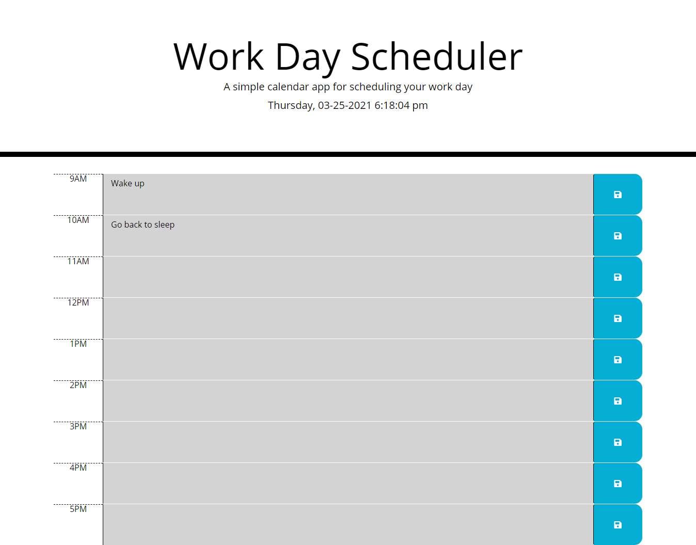

# Work-Day-Scheduler

## Description

This is a workday scheduler with time slots for each hour between 9:00am and 5:00pm. The user can input tasks for each time slot and store them for later references.

## Features

There is a live clock in the jumbotron of the page that gets updated every second, displaying both the current date and time.

The time slots are colored differently depending on the current time; past time slots are in gray, present in red, and future in green. This is updated every time the page is refreshed.

When the user types in the time slots and presses the save button, the current input will be saved to local storage, which will be displayed every time the page is reloaded.

## Deployed URL

https://runescape11111.github.io/Work-Day-Scheduler/

## Screenshot

